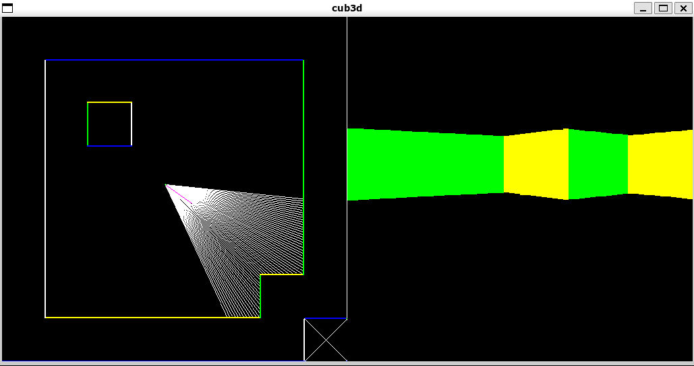

# cub3d

| Specs  | Explanation |
| ------------- | ------------- |
| Program name | cub3d |
| Turn in files | All your files |
| Makefile | all, clean, fclean, re, bonus |
| Arguments | a map in format \*.cub |
| External functs. | - open, close, read, write,   printf, malloc, free, perror,   strerror, exit   - All functions of the math library   - All functions of the MinilibX | 
| Libft authorized | Yes |
| Description | You must create a "realistic" 3D graphical representation of the inside of a maze from a first-person perspective. You have to create this representation using the Ray-Casting principles mentioned earlier. |

The constrains are as follows:
- You must use the miniLibX. Either the version that is available on the operationg system, or from its sources. If you choose to work with the sources, you will need to apply the same rules for your libft as those written above in Common Instruction part.
- The management of your window must remain smooth: changing to another window, minimizing, etc.
- Display different wall textures (the choice is yours) that vary depending on which side the wall is facing (North, South, East, West).
- Your program must be able to set the flooer and ceiling colors to two different ones.
- The program displays the image in a window and respects the following rules:
  - The left and right arrow keys of the keyboard must allow you to look left and right in the maze.
  - The W, A, S, and D keys must allow you to move the point of view through the maze.
  - Pressing ESC must close the window and quit the program cleanly.
  - Clicking on the red cross on the window's frame must close the window and quit the program cleanly.
  - The use of images of the minilibX is strongly recommended.
- Your program must take as a first argument a scene description file with the .cub extension.
  - The map must be composed of only 6 possible characters: 0 for an empty space, 1 for a wall, and N,S,E or W for the player's start position and spawing orientation.
This is a simple valid map:
111111
100101
101001
1100N1
111111
  - The map must be closed/surrounded by walls, if not the program must return an error.
  - Except for the map content, each type of element can be separated by one or more empty line(s).
  - Except for the map content, each type of element can be separated by one or more empty line(s).
  - Except for the map content which always has to be last, each type of element can be set in any order in the file. 
  - Except for the map, each type of information from an element can be separated by one or more space(s).
  - The map must be parsed as it looks in the file. Spaces are a valid part of the maps and are up to you to handle. You must be able to parse any kind of map, as long as it respects the rules of the map.
  - 
